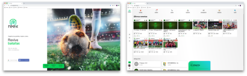
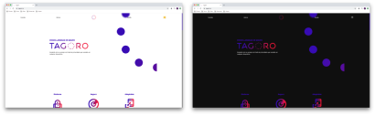
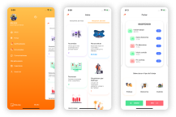
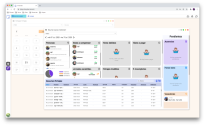
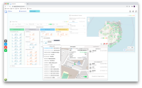

    

 
 
 

 

## Heya! I'm a Frontend developer 👨‍💻 from Canary Islands, Spain 🇮🇨

### I love to make new projects taking care all the aspects about the needs of the users. I always has been attracted to the design world and I enjoy investigating and learning new design techniques.

### I started to developing and designing apps more than 10 years ago. 

### I ❤️ **Javascript** and I've been developing ⚛️ **React** apps from 4 years.

### Currently I'm using coding with **VSCode** and designing with **Figma**.

 

# Last posts

### You can read me on my devto [profile](https://dev.to/ayozebarrera) 

* [Como crear una guía de estilo con Figma](https://dev.to/capua/como-crear-una-guia-de-estilo-con-figma-269o)
* [Mapeando tus movimientos con React y Leaflet](https://dev.to/capua/mapeando-tus-movimientos-con-react-y-leaflet-3bce)
* [Como crear un paquete de Node](https://dev.to/capua/como-crear-un-paquete-de-node-3hp3)
* [Mapeando con Javascript](https://dev.to/capua/mapeando-con-javascript-1k4g)  

 

# Last projects

### I've developed and designed this projects with React and React Native

## [Reex](reex.pro): Social network for female football

    

---

## [Tagoro](https://tagoro.io/): Private video calls for groups

    

---

## Timeview Native (WIP): Platform for managing the human resources of a company for devices

    

---

## [Timeview](https://www.timeview.io/): Platform for managing the human resources of a company

    

---

## [Fleetview](https://www.timeview.io/): Platform for managing fleets and assets of a company

    

---

## [Fleetview](https://www.timeview.io/): Platform for managing fleets and assets of a company

    

<!--
**ayozebarrera/ayozebarrera** is a ✨ _special_ ✨ repository because its `README.md` (this file) appears on your GitHub profile.



Here are some ideas to get you started:

- 🔭 I’m currently working on ...
- 🌱 I’m currently learning ...
- 👯 I’m looking to collaborate on ...
- 🤔 I’m looking for help with ...
- 💬 Ask me about ...
- 📫 How to reach me: ...
- 😄 Pronouns: ...
- ⚡ Fun fact: ...
-->